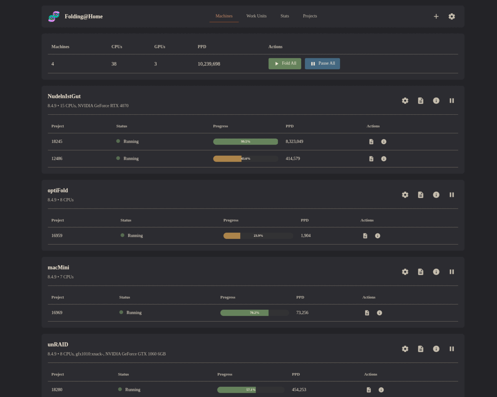

# Folding@Home Control

A locally hosted web interface for controlling Folding@Home v8.4 clients. This application allows you to manage multiple FAH instances (local and remote) without relying on external services that might be sometimes inaccessible (e.g., the official F@H webclient being down due to a Cloudflare outage).

Written specifically for v8.4.9 clients. Other versions may not be supported.

## Preview



*Animated preview showing the main dashboard, machine management, and settings interface*

## Prerequisites

- Node.js (v14 or higher)
- npm or yarn
- Folding@Home v8.4 client(s) running and accessible

## Installation

1. Clone or download this repository
2. Install dependencies:
   ```bash
   npm install
   ```

## Usage

1. Start the server:
   ```bash
   npm start
   ```

2. Open your browser and navigate to:
   ```
   http://localhost:3000
   ```

3. The application will automatically try to connect to `127.0.0.1:7396` (the default FAH client port)

4. To add additional instances:
   - Click the settings (⚙️) button in the top right
   - Enter the instance name, host/IP, and port (default: 7396)
   - Click "Add Instance"

## Configuration

### Local Instance
If FAH is running locally (`127.0.0.1:7396`), it is added by default and cannot be removed. 

### Remote Instances
You can add remote instances (➕) by:
- **Local Network**: Use the local IP address (e.g., `192.168.1.100`)
- **External Access**: Use a domain name or external IP (ensure the FAH client is configured to accept remote connections)

### FAH Client Configuration
For remote access, you need to configure your FAH client to accept WebSocket connections:

1. **Locate the FAH client configuration file:**
   - **Linux**: `/etc/fah-client/config.xml` or `~/.config/fah-client/config.xml`
   - **Windows**: `C:\Users\<YourUsername>\AppData\Roaming\FAHClient\config.xml`

2. **Edit the configuration file** (may require admin/sudo privileges):
   - Add the following to your `<config>` section:
   ```xml
   <http-addresses v='0.0.0.0:7396'/>
   <allow v='127.0.0.1 10.0.0.0/8 192.168.0.0/16 172.16.0.0/12 169.254.0.0/16'/>
   <deny v='0/0'/>
   ```
   
   **Configuration explanation:**
   - `<http-addresses v='0.0.0.0:7396'/>` - Makes the HTTP/WebSocket server listen on all interfaces (0.0.0.0) on port 7396
   - `<allow v='...'/>` - Lists allowed IP addresses and CIDR ranges:
     - `127.0.0.1` - Localhost
     - `10.0.0.0/8` - Private network range (10.x.x.x)
     - `192.168.0.0/16` - Private network range (192.168.x.x)
     - `172.16.0.0/12` - Private network range (172.16-31.x.x)
     - `169.254.0.0/16` - Link-local addresses
   - `<deny v='0/0'/>` - Denies all other connections by default
   
   **For a more restrictive setup** (e.g., only your local network):
   ```xml
   <http-addresses v='0.0.0.0:7396'/>
   <allow v='127.0.0.1 192.168.1.0/24'/>
   <deny v='0/0'/>
   ```

3. **Restart the FAH client** to apply changes:


4. **Adjust firewall settings** on the remote machine to allow port 7396:
   ```bash
   # Example for ufw (Ubuntu/Debian)
   sudo ufw allow 7396/tcp
   
   # Example for firewalld (RHEL/CentOS)
   sudo firewall-cmd --add-port=7396/tcp --permanent
   sudo firewall-cmd --reload
   ```

**Additional Resources:**
- [Folding Forum Discussion](https://foldingforum.org/viewtopic.php?t=39050) - More examples and configuration options

**Note:** Be as restrictive as possible with the `allow` setting for security. Only include the IP ranges that you actually need.

## API Endpoints

The server provides the following API endpoints:

- `GET /api/instances` - Get all configured instances
- `POST /api/instances` - Add a new instance
- `DELETE /api/instances/:id` - Remove an instance
- `GET /api/fah/:instanceId/*` - Proxy requests to FAH clients
- `GET /api/aggregate/*` - Get aggregated data from all instances


## Stats

**Note**: All external API calls can be disabled in settings (⚙️) if you prefer not to use external services.

### Sources

- **Folding@Home API**: Team statistics, user contributions, and team rankings
- **Extreme Overclocking (EOC)**: Detailed user statistics, production history, and conquests/threats rankings

### Configuration

To view stats, configure the following in Settings (⚙️):

1. **Enable External API Calls**: Toggle this option to allow fetching data from external APIs (F@H and EOC)
   - When disabled, the stats page will show a message indicating external API calls are disabled
   - External API calls are enabled by **default**

2. **EOC User ID**: Enter your Extreme Overclocking User ID to view your personal EOC statistics
   - Find your EOC User ID by visiting [folding.extremeoverclocking.com](https://folding.extremeoverclocking.com/user_summary.php) and checking the URL (e.g., `?u=833191`)
   - EOC stats include:
     - Summary statistics (rank, points, WUs)
     - Top 5 Conquests and Threats rankings
     - Production history graphs (hourly, daily, weekly, monthly)
     - Production tables

3. **Team Numbers**: Add one or more team numbers to view team statistics
   - Team stats are automatically pulled from the Folding@Home API
   - Your contributions to each team is calculated and displayed
   - Teams can be added or removed from the settings (⚙️) page


## Troubleshooting

### Cannot connect to local instance
- Ensure Folding@Home client is running
- Check that the client is listening on port 7396 (default for FAH v8.4)
- Verify the client allows local connections

### Cannot connect to remote instance
- **Check the FAH client configuration**: Ensure `<web-allow>` includes your IP or network range in the client's `config.xml`
- **Restart the FAH client** after making config changes
- **Check network connectivity**: Verify you can reach the remote machine (try `ping 192.168.1.105`)
- **Check firewall settings**: Ensure port 7396 is open on the remote machine
- **Verify the client is running**: Check that the FAH client service is active on the remote machine
- **Check the correct IP and port**: Default port is 7396 (not 36330)

### API errors
- Some FAH client versions may use different API endpoints
- Check the browser console for specific error messages
- You may need to adjust the API endpoint paths in `app.js` to match your FAH client version


## License

MIT License - see [LICENSE](LICENSE) file for details.
